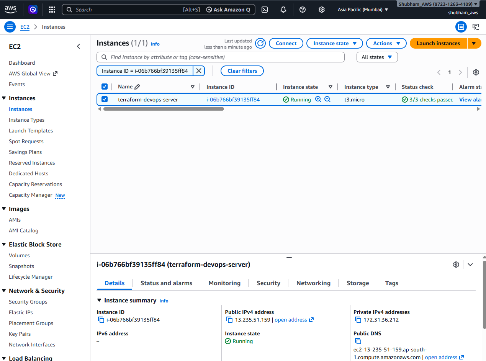
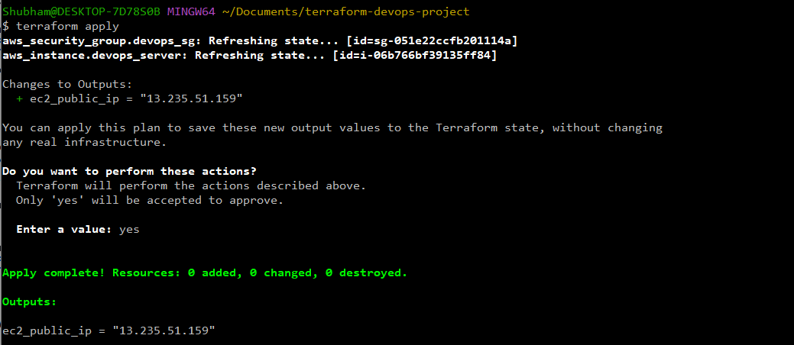
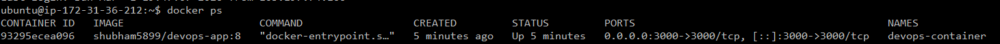
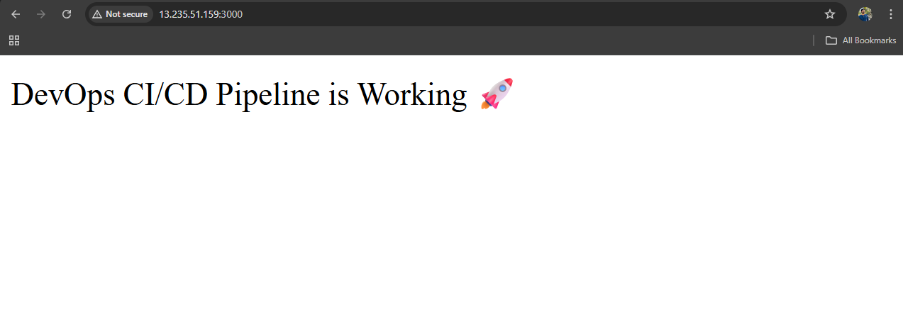

# 🚀 Terraform AWS Docker Deployment

This project provisions an EC2 instance using Terraform and automatically deploys a Dockerized Node.js application.

## 🏗 Architecture

- AWS EC2 (t3.micro)
- Security Group (Port 22, 3000)
- Docker installed via user_data
- Docker image pulled from DockerHub
- Application exposed on port 3000

## ⚙️ Technologies Used

- Terraform
- AWS EC2
- Docker
- Ubuntu 24.04
- DockerHub

## 📦 Deployment Steps

1. Initialize Terraform
   terraform init

2. Apply Infrastructure
   terraform apply

3. Access Application
   http://<<EC2-Public-IP>>:3000

## 📤 Outputs

Terraform automatically prints the EC2 Public IP after deployment.

## 🧠 Key Learnings

- Infrastructure as Code (IaC)
- EC2 provisioning with Terraform
- Docker automation using user_data
- Debugging cloud-init issues
- Security Group configuration

## Application Running

